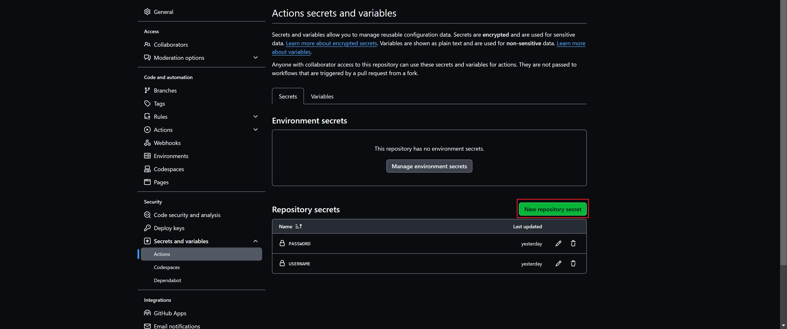
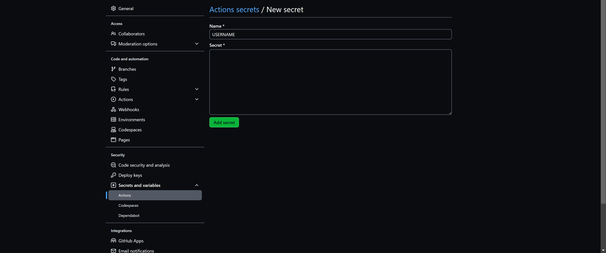

# easonFansForumDaily
自动完成神经研究所每日任务

## 文件说明
- dailyMission.py 保存了完成每日任务的脚本，包括签到、答题和摩天轮抽奖。

## 使用方法
fork本repositroy后，在Settings->Secrets中新建仓库密码（New repository secret）。添加Name为`USERNAME`和`PASSWORD`的环境变量，分别添加自己神经研究所的账号和密码。添加Name为`MAIL_USERNAME`和`MAIL_PASSWORD`的环境变量，分别添加自己邮箱的SMTP账号和密码。



## 本地运行
1. Clone this repo and install prerequisites:

    ```bash
    # Clone this repo
    git clone git@github.com:TannerTam/easonFansForumDaily.git
    
    # Create a Conda environment
    conda create -n easonFansForumDaily python=3.10.0
    conda activate easonFansForumDaily
    
    # Install prequisites
    pip install -r requirements.txt
    # Install packages
    sudo apt update
    sudo apt install tesseract-ocr
    ```

2. 在本地新建`config.json`文件，内容为

    ```json
    {
        "USERNAME": "",
        "PASSWORD": "",
        "MAIL_USERNAME": "",
        "MAIL_PASSWORD": ""
    }
    ```
3. 下载与自己chrome版本相符合的chrome driver，并将路径保存到变量chromedriver
4. 运行

    ```bash
    #无头
    python dailyMission.py --local --headless
    
    #显示窗口
    python dailyMission.py --headless
    ```
